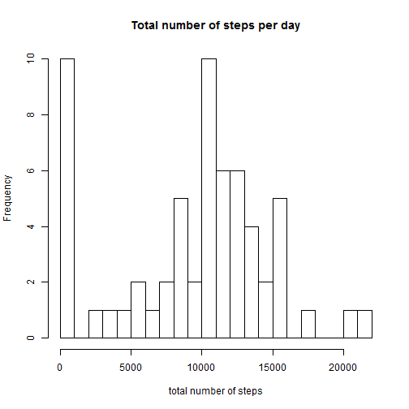
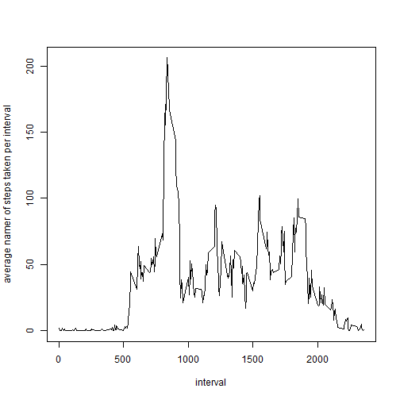
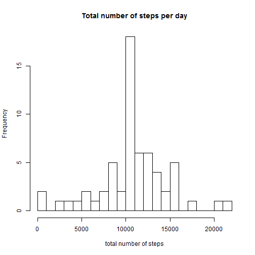
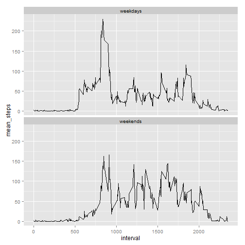

# PA1 Research

###Anton Z.

##Introduction

Before we started our research let's load the data.


```r
data <- read.csv('activity.csv')
```

We also need some package to load:


```r
library(dplyr)
library(ggplot2)
```

##Mean total number of steps taken per day

Histogram of the total number of steps taken each day


```r
df <- data %>%
        group_by(date) %>%
        summarize(ttl_steps = sum(steps, na.rm = T))

hist(df$ttl_steps, breaks = 20, xlab = "total number of steps", main = 'Total number of steps per day')
```

 

Mean and median total number of steps taken per day are


```r
summary(df)[c(4,3),2]
```

```
##                                     
## "Mean   : 9354  " "Median :10395  "
```

##Average daily activity pattern
Time series plot of the 5-minute interval and the average number of steps taken, averaged across all days


```r
df2 <- data %>%
        group_by(interval) %>%
        summarize(ttl_steps = mean(steps, na.rm = T))

plot(x = df2$interval, y = df2$ttl_steps, type ="l", xlab= "interval", ylab = "average namer of steps taken per interval")
```

 

Interval

```r
df2[df2$ttl_steps == max(df2$ttl_steps), ]
```

```
## Source: local data frame [1 x 2]
## 
##   interval ttl_steps
## 1      835  206.1698
```
(i.e 8:30-8:35) contains the maximum number of steps.

##Missing values

Total number of missing values is:


```r
sum(is.na(data$steps))
```

```
## [1] 2304
```

We will fill missing values with the mean for that 5-minute interval.


```r
data2 <- data

for (i in 1:nrow(data2)) {
        if (is.na(data2[i,1]) == T)
                data2[i,1] <- df2[df2$interval == data2[i,3],2]        
}
```

Now histogram of the total number of steps taken each day looks like this


```r
ndf <- data2 %>%
        group_by(date) %>%
        summarize(ttl_steps = sum(steps, na.rm = T))

hist(ndf$ttl_steps, breaks = 20, xlab = "total number of steps", main = 'Total number of steps per day')
```

 

After filling missing values we have got a new, higher, value of mean and median of total number of steps taken per day:


```r
summary(ndf)[c(4,3),2]
```

```
##                                     
## "Mean   :10766  " "Median :10766  "
```

##Differences in activity patterns between weekdays and weekends

First of all let me set the locale to avoid any misunderstandings.


```r
Sys.setlocale("LC_TIME", "English")
```

```
## [1] "English_United States.1252"
```

Now we are ready to find patterns of weekdays and weekends.


```r
data2 <- data2 %>%
        mutate(weekday = weekdays(as.Date(date), abbreviate = T))

for (i in 1:nrow(data2)) {
        if (data2[i,4] %in% c("Mon","Tue","Wed","Thu","Fri"))
                data2[i,4] <- "weekdays"
        else data2[i,4] <- "weekends"
        
}

res <- data2 %>%
        group_by(weekday, interval) %>%
        summarize(mean_steps = mean(steps, na.rm = T))
```

Let's have a look at the result:


```r
ggplot(data = res, aes(x = interval, y = mean_steps)) + facet_wrap(~weekday, nrow = 2, ncol = 1) + geom_line()
```

 

Now we can clearly see differences between weekdays and weekends.

##Thank you for attention!
